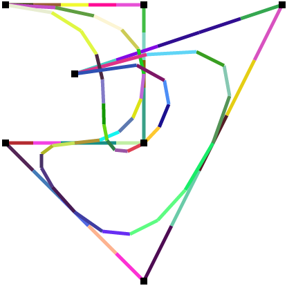

B-spline
=============
[B-spline](http://en.wikipedia.org/wiki/B-spline) for generating a curve from a list of control points and knots.

The following [example](example.js) uses the same control points and shows the effect of degree, tesselation, and knot multiplicity.



## Install - not yet on npm!

    npm install b-spline2

## Example

```javascript
var bspline = require("b-spline")

var control_points = [[0,0], [200,0], [200,200], [0,200], [400,300], [600,200], [100,100]]
var knots = [1,2,3,4,5,6,7,8,9,10]
var tessellation = 10
var myspline = bspline(control_points, knots, tessellation)
```

### Turn mesh positions into a spline
```javascript
var knots = new Array(Mesh.positions.length + 3 + 1)
for(var i = 0; i < knots.length; i++) {
  knots[i] = i
}
var spline = bspline(Mesh.positions, knots, 3)
```

## API

#### `require("b-spline")(control_points, knots, tessellation)`
Returns a b-spline in n-dimensions evaluated a "tessellation" number of times for each knot interval with full support.  The knots do not need to be uniform but each control point should be of the same dimension.

The number of knots is:

	knots = control_points + degree + 1

## Note
This has not been rigorously tested.  Any help in verification/optimization would be appreciated.

## Credits
(c) 2015 Michael Kummer. MIT License
